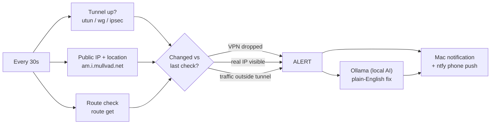

# 🛡️ VPN Guardian

A personal security agent that watches your internet connection, catches VPN drops and leaks, and alerts you on your Mac and your phone. Built entirely with free tools.

> Most people trust their VPN blindly. VPN Guardian checks that it's actually working.

## What it does (v1.1)

- **VPN drop alerts:** notifies you the moment your VPN disconnects and your real IP is exposed
- **IP leak detection:** catches when the VPN says "connected" but websites still see your real IP
- **Route leak detection:** catches when traffic is leaving outside the VPN tunnel
- **Location tracking:** shows the city and country websites think you're in, and alerts when it changes
- **Network awareness:** alerts on Wi-Fi changes and going offline, and logs DNS changes
- **Phone alerts:** free push notifications through [ntfy.sh](https://ntfy.sh)
- **AI explanations (new in v1.1):** a local AI model through [Ollama](https://ollama.com) explains each alert in plain English and tells you what to do. It runs on your Mac, so nothing is sent anywhere
- **Full log** at `~/.vpn-guardian/log.txt`

## See it in action

A coffee shop session where the VPN drops mid-session (from `~/.vpn-guardian/log.txt`; IPs and places swapped for examples):

```text
09:14:02  VPN Guardian v1.1 starting (every 30s, phone alerts: on, AI explain: on (hermes3))
09:14:03  VPN: utun4 | Sites see: 185.65.134.20 (Amsterdam, Netherlands) via Mullvad VPN | Route: utun4 | Wi-Fi: Coffee-Guest
09:41:33  ALERT: VPN DROPPED on Coffee-Guest. Your real IP (203.0.113.42, Los Angeles, United States) is exposed.
09:41:38  AI: Your VPN turned off, so websites can see your real location on this public Wi-Fi.
          Fix: reconnect your VPN before you keep browsing or log in to anything.
09:42:04  ALERT: VPN connected. Sites now see you in Amsterdam, Netherlands (185.65.134.20).
```

Each `ALERT` also pops up as a Mac notification and, if set up, a push to your phone. The `AI` line is written by a model running on your own Mac.

## Website

The landing page lives in `docs/`. Turn it on in **Settings → Pages → Deploy from branch → main → /docs**, and it goes live at `https://jeffreyesdavid.github.io/vpn-guardian/`.

## Quick start (macOS)

```bash
git clone https://github.com/jeffreyesdavid/vpn-guardian.git
cd vpn-guardian
chmod +x vpn-guardian.sh
./vpn-guardian.sh
```

Run it once with your VPN **off** so it learns your real IP, then turn your VPN on.

### Optional: AI explanations

Install [Ollama](https://ollama.com), then:

```bash
ollama pull hermes3
./vpn-guardian.sh --explain "VPN DROPPED on Coffee-Guest."
```

If Ollama is running, every alert gets a second notification explaining what it means. Turn it off with `AI_EXPLAIN=0` in the config.

### Optional: phone alerts

```bash
mkdir -p ~/.vpn-guardian
cp config.example ~/.vpn-guardian/config
```

Install the **ntfy** app, subscribe to a long random topic name, and put that name in `NTFY_TOPIC` in the config.

## How it works



Every 30 seconds it checks:

| Check | How |
|---|---|
| Is a VPN tunnel up? | Looks for `utun`/`ipsec`/`ppp`/`wg` interfaces with an IPv4 address |
| What IP and location do sites see? | Free lookup from `am.i.mullvad.net` (falls back to ipify) |
| Is traffic using the tunnel? | `route get` shows which interface internet traffic leaves through |
| Did anything change? | Compares against the last check and alerts only on changes |

## Roadmap

- [x] **v0:** VPN drop, IP leak, and route leak alerts
- [x] **v1:** location tracking + free phone alerts (ntfy)
- [x] **v1.1:** local AI explanations with Ollama (early piece of v5)
- [ ] **v2:** DNS leak test, IPv6/WebRTC leak checks, risky Wi-Fi warnings
- [ ] **v3:** VPN app auditor that grades installed VPNs A–F (owner, country, permissions, trackers)
- [ ] **v4:** self-hosted WireGuard on a Raspberry Pi or free-tier cloud server, with server rotation
- [ ] **v5:** AI layer with [Ollama](https://ollama.com) (runs locally, free) that explains alerts in plain English
- [ ] **v6:** home network watch with Pi-hole + CrowdSec, and a dashboard

## Free tools this builds on

WireGuard · Tailscale/Headscale · Mullvad leak check · ntfy · Pi-hole · LuLu · CrowdSec · Ollama

## Limitations

- macOS only for now
- Tailscale and similar mesh tools count as VPN tunnels
- Split-tunnel VPNs will show as route leaks (that's by design: it tells you some traffic is outside the tunnel)

## License

MIT
